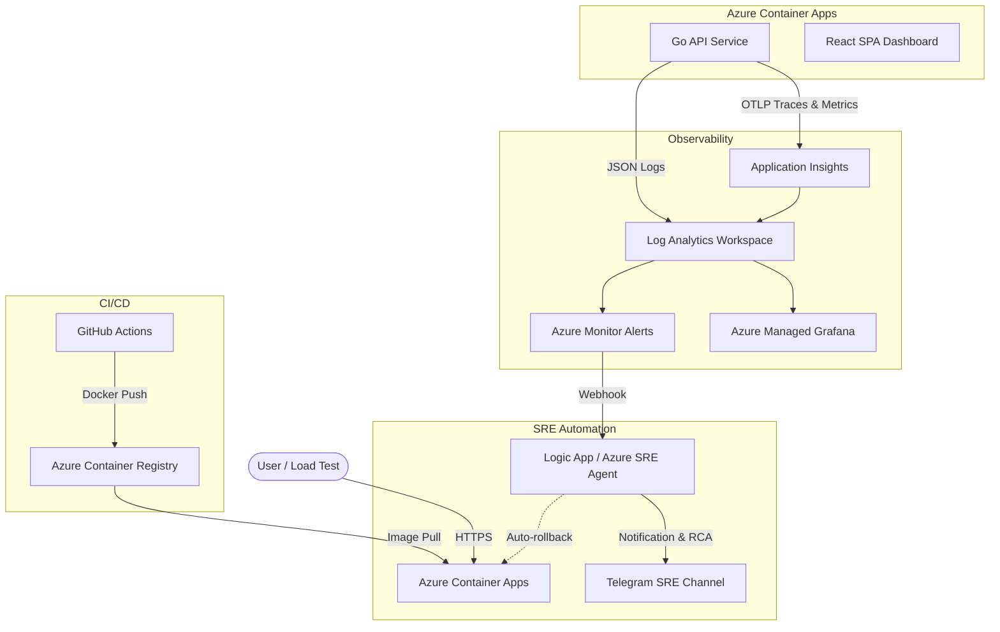

# System Architecture

The **Azure SRE Autonomous Operations Demo** is designed using Microsoft Azure's cloud-native platform services. The architecture heavily favors **PaaS/Serverless** components to minimize management overhead and maximize observability.

## High-Level Diagram

## Core Components

### 1. Azure Container Apps (ACA)
- **Why ACA?** It provides a serverless container environment built on top of AKS, but without the management overhead. It natively supports **Traffic Splitting (Revisions)**, which is crucial for our Canary Deployment scenario.
- **Backend:** A Go 1.22 API service. It uses `slog` for structured logging and the OpenTelemetry Go SDK to push W3C traces. It exposes specific `/fault/*` endpoints to safely inject chaos into the environment without altering the underlying infrastructure.
- **Frontend:** A React + Vite dashboard. It visualizes the traffic split, recent events, and SLO health.

### 2. Log Analytics Workspace (LAW) & App Insights
- **Why?** It acts as the centralized data lake for all telemetry.
- **ContainerAppConsoleLogs_CL:** Contains our structured JSON logs from the Go backend.
- **ContainerAppSystemLogs_CL:** Contains orchestrator logs (e.g., container restarts, `OOMKilled` exit code 137).
- Application Insights automatically correlates traces and metrics to provide out-of-the-box performance dashboards.

### 3. Azure Managed Grafana
- Provides real-time dashboards to visualize the SLIs (Service Level Indicators) like HTTP Error Rates, Request Rates, and P95 Latency percentiles queried directly from the Log Analytics Workspace.

### 4. Azure Monitor Alerts & Telegram Integration
- **Alert Rule:** Triggers when the HTTP 5xx error rate exceeds 5% in a 5-minute window.
- **Action Group:** Normally sends an email or triggers a webhook. In our advanced scenario, it triggers the **Azure SRE Agent** (simulated via Webhook/Logic App) which correlates the trace ID back to the source code repository on GitHub.
- **Notification:** The agent formats an RCA summary and posts it to a Telegram group, providing the exact line of code causing the issue and offering auto-remediation (rollback).

## Telemetry Flow (The "Evidence")

To achieve Autonomous Operations, the data must be completely structured:
1. **Trace ID Injection:** Every HTTP request gets a Trace ID.
2. **Context Propagation:** The Trace ID is appended to every structured JSON log line via the Go `slog` middleware.
3. **Ingestion:** Azure Monitor ingests the logs.
4. **Correlation:** When an error breaches an SLO, Kusto queries (`kql/`) extract the exact Trace IDs from the time window.
5. **RCA:** The LLM uses these Trace IDs to find the exact stack trace and cross-references it with the GitHub repository.
