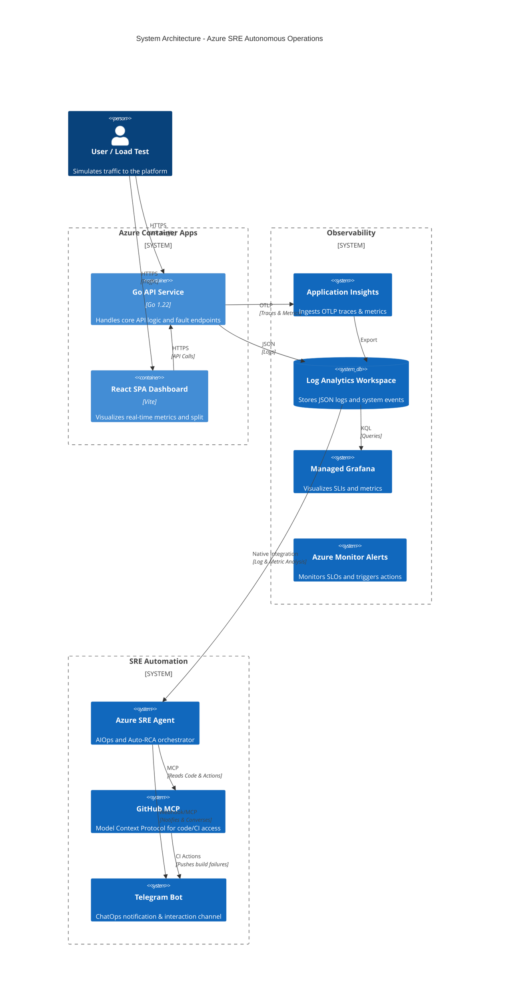

# System Architecture

The **Azure SRE Autonomous Operations Demo** is designed using Microsoft Azure's cloud-native platform services. The architecture heavily favors **PaaS/Serverless** components to minimize management overhead and maximize observability.

## High-Level Diagram

## Core Components

### 1. Azure Container Apps (ACA)
- **Why ACA?** It provides a serverless container environment built on top of AKS, but without the management overhead. It natively supports **Traffic Splitting (Revisions)**, which is crucial for our Canary Deployment scenario.
- **Backend:** A Go 1.22 API service. It uses `slog` for structured logging and the OpenTelemetry Go SDK to push W3C traces. It exposes specific `/fault/*` endpoints to safely inject chaos into the environment without altering the underlying infrastructure.
- **Frontend:** A React + Vite dashboard. It visualizes the traffic split, recent events, and SLO health.

### 2. Log Analytics Workspace (LAW) & App Insights
- **Why?** It acts as the centralized data lake for all telemetry.
- **ContainerAppConsoleLogs_CL:** Contains our structured JSON logs from the Go backend.
- **ContainerAppSystemLogs_CL:** Contains orchestrator logs (e.g., container restarts, `OOMKilled` exit code 137).
- Application Insights automatically correlates traces and metrics to provide out-of-the-box performance dashboards.

### 3. Azure Managed Grafana
- Provides real-time dashboards to visualize the SLIs (Service Level Indicators) like HTTP Error Rates, Request Rates, and P95 Latency percentiles queried directly from the Log Analytics Workspace.

### 4. Official Azure SRE Agent & Telegram Integration
- **Azure SRE Agent:** A specialized AI agent deployed via ARM templates with `SRE Agent Administrator` role access. It natively connects to Log Analytics and App Insights to read production telemetry.
- **GitHub MCP:** The agent uses the Model Context Protocol (MCP) to read repository code, pull requests, and CI/CD logs (e.g., Trivy Security scan failures) directly.
- **Knowledge Base:** Driven by a custom `docs/sre_runbook.md` to ensure the agent follows strict team SOPs.
- **Telegram Bot:** Pushes instant notifications for CI/CD failures and provides a ChatOps interface for the SRE team to ask the AI for immediate root cause analysis (Auto-RCA).

## Telemetry Flow (The "Evidence")

To achieve Autonomous Operations, the data must be completely structured:
1. **Trace ID Injection:** Every HTTP request gets a Trace ID.
2. **Context Propagation:** The Trace ID is appended to every structured JSON log line via the Go `slog` middleware.
3. **Ingestion:** Azure Monitor ingests the logs.
4. **Correlation:** When an error breaches an SLO, Kusto queries (`kql/`) extract the exact Trace IDs from the time window.
5. **RCA:** The LLM uses these Trace IDs to find the exact stack trace and cross-references it with the GitHub repository.
