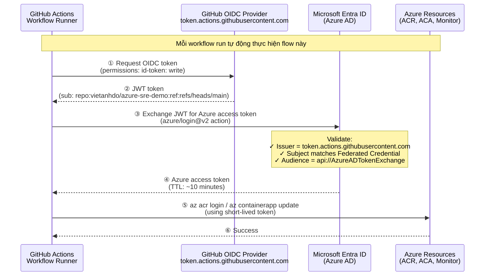
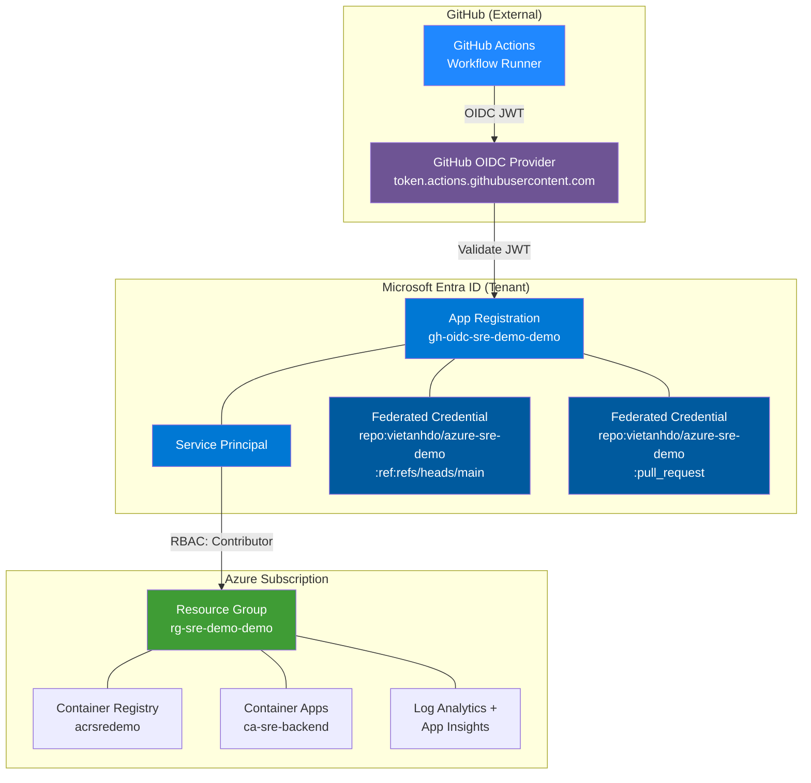

# GitHub Actions ↔ Azure Authentication: OIDC (Workload Identity Federation)

## Mục đích

Tài liệu này giải thích **tại sao** project sử dụng OIDC cho GitHub Actions authentication,
so sánh với các phương pháp thay thế, và hướng dẫn setup từ đầu.

---

## Tại sao chọn OIDC?

### Tất cả các phương pháp Authentication

| # | Approach | Secrets cần lưu | Token Lifetime | Rotation | Enterprise-Ready | Cost |
|---|---------|-----------------|---------------|----------|-----------------|------|
| 1 | **OIDC / Workload Identity Federation** ✅ | `CLIENT_ID`, `TENANT_ID`, `SUBSCRIPTION_ID` (không phải secrets thật) | ~10 phút | ❌ Không cần | ✅ Recommended | $0 |
| 2 | Service Principal + Client Secret | `CLIENT_ID`, `CLIENT_SECRET`, `TENANT_ID`, `SUBSCRIPTION_ID` | 1-2 năm | ⚠️ Manual/Automate | ⚠️ Legacy | $0 |
| 3 | Service Principal + Client Certificate | `CLIENT_ID`, `CLIENT_CERTIFICATE` (base64), `TENANT_ID`, `SUBSCRIPTION_ID` | 1-2 năm | ⚠️ Cert renewal | ⚠️ Partial | $0 |
| 4 | Azure Publish Profile (App Service only) | `PUBLISH_PROFILE` (XML) | ∞ | ⚠️ Manual | ❌ Limited | $0 |
| 5 | Self-hosted Runner + Managed Identity | Không cần secrets | ∞ (auto-refresh) | ✅ Azure-managed | ✅ Yes | $50-200/mo |

### Security Comparison

| Criteria | OIDC | SP + Secret | SP + Cert | Self-hosted + MI |
|----------|------|------------|-----------|-----------------|
| **Secret Exposure Risk** | 🟢 None | 🔴 High | 🟡 Medium | 🟢 None |
| **Token Lifetime** | 🟢 ~10 min | 🔴 1-2 years | 🔴 1-2 years | 🟢 Auto-rotate |
| **Blast Radius (if leaked)** | 🟢 Minimal | 🔴 Full access | 🟡 Full access | 🟢 VM-scoped |
| **Zero Trust Aligned** | ✅ Yes | ❌ No | ⚠️ Partial | ✅ Yes |
| **Compliance (SOC2/CIS)** | ✅ Full | ⚠️ With rotation | ⚠️ With rotation | ✅ Full |

### Kết luận

**OIDC là lựa chọn tối ưu nhất** vì:

1. **Zero secret exposure** — Các giá trị `CLIENT_ID`, `TENANT_ID`, `SUBSCRIPTION_ID` không phải secrets thật (chúng là public identifiers). Không có `CLIENT_SECRET` nào được lưu trữ.
2. **Short-lived tokens** — JWT từ GitHub hết hạn sau ~10 phút. Nếu bị leak, attacker có rất ít thời gian exploit.
3. **Scoped trust** — Azure chỉ cấp token khi JWT khớp chính xác với repo + branch. Fork repo → bị reject.
4. **No rotation burden** — Không cần rotate credentials bao giờ. Giảm operational overhead.
5. **Microsoft-recommended** — Đây là phương pháp chính thức được Microsoft khuyến nghị cho GitHub Actions.

---

## Architecture Diagram



### Component Diagram



---

## OIDC hoạt động như thế nào?

### Federated Identity Credential — Trust Model

Mỗi Federated Identity Credential là một **"luật tin tưởng"** định nghĩa:

| Field | Value | Ý nghĩa |
|-------|-------|---------|
| **Issuer** | `https://token.actions.githubusercontent.com` | Chỉ trust JWT từ GitHub |
| **Subject** | `repo:vietanhdo/azure-sre-demo:ref:refs/heads/main` | Chỉ trust workflow chạy trên branch main của repo này |
| **Audience** | `api://AzureADTokenExchange` | Azure AD default audience |

### Subject format

```
repo:{owner}/{repo}:{context}

Ví dụ:
  repo:vietanhdo/azure-sre-demo:ref:refs/heads/main     ← push to main
  repo:vietanhdo/azure-sre-demo:pull_request             ← pull requests
  repo:vietanhdo/azure-sre-demo:environment:production   ← GitHub Environment
```

### Tại sao Fork attack bị chặn?

Khi attacker fork repo `vietanhdo/azure-sre-demo` thành `attacker/azure-sre-demo`:
- JWT subject sẽ là: `repo:attacker/azure-sre-demo:ref:refs/heads/main`
- Federated Credential chỉ trust: `repo:vietanhdo/azure-sre-demo:ref:refs/heads/main`
- **Subject không khớp → Azure REJECT → Không có access token**

---

## Setup Guide (Step-by-step)

### Prerequisites

```bash
# Required tools
az --version        # Azure CLI >= 2.50
terraform --version # Terraform >= 1.5
gh --version        # GitHub CLI (optional, for setting secrets)
```

### Step 1: Login Azure

```bash
# Đăng nhập bằng tài khoản có quyền:
#   - Application Administrator (Entra ID) — để tạo App Registration
#   - Owner hoặc User Access Administrator (Subscription) — để gán RBAC
az login
az account set --subscription "<your-subscription-id>"
```

### Step 2: Terraform Apply

```bash
cd infra/terraform
terraform init      # Download azuread provider
terraform plan      # Review changes (xem module.github_oidc resources)
terraform apply     # Tạo App Registration + SP + Federated Credentials + RBAC
```

### Step 3: Configure GitHub Secrets

```bash
# Option A: Dùng gh CLI (recommended)
terraform output -raw github_secrets_setup | bash

# Option B: Manual
# Copy values từ terraform output:
terraform output github_oidc_client_id
terraform output github_oidc_tenant_id
terraform output github_oidc_subscription_id
# Paste vào: GitHub Repo → Settings → Secrets and variables → Actions → New repository secret
```

### Step 4: Verify

```bash
# Trigger CI workflow
git commit --allow-empty -m "test: verify OIDC authentication"
git push origin main

# Check workflow logs: Actions → CI → "Azure login" step should show:
# "Login successful using OIDC/Federated Credentials"
```

---

## Troubleshooting

### Error: "AADSTS70021: No matching federated identity record found"

**Nguyên nhân**: Subject trong JWT không khớp với Federated Identity Credential.

**Fix**:
1. Check workflow trigger: `push` to `main`? `pull_request`? `workflow_dispatch`?
2. Federated Credential subject phải match chính xác
3. Nếu dùng `workflow_dispatch`, cần thêm Federated Credential cho subject: `repo:vietanhdo/azure-sre-demo:ref:refs/heads/main` (dispatch trên main vẫn dùng ref subject)

### Error: "AADSTS700016: Application not found"

**Nguyên nhân**: `AZURE_CLIENT_ID` sai hoặc App Registration bị xóa.

**Fix**: Chạy `terraform output github_oidc_client_id` → update GitHub Secret.

### Error: "AuthorizationFailed" khi deploy

**Nguyên nhân**: Service Principal không có đủ RBAC permissions.

**Fix**: Verify role assignment:
```bash
az role assignment list --assignee $(terraform output -raw github_oidc_client_id) --scope $(az group show -n rg-sre-demo-demo --query id -o tsv)
```

---

## RBAC Scope

| Level | Ưu điểm | Nhược điểm | Quyết định |
|-------|---------|-----------|-----------|
| Subscription | Đơn giản | Over-privileged | ❌ Không dùng |
| **Resource Group** | Đúng scope cho project | Cần manage per-RG | ✅ **Đang dùng** |
| Individual Resources | Least privilege | Phức tạp | ⚠️ Cho production hardening |

Hiện tại: **Contributor** trên **Resource Group** `rg-sre-demo-demo`.

---

## References

- [Microsoft: Use GitHub Actions to connect to Azure (OIDC)](https://learn.microsoft.com/en-us/azure/developer/github/connect-from-azure)
- [GitHub: Configuring OIDC in Azure](https://docs.github.com/en/actions/security-for-github-actions/security-hardening-your-deployments/configuring-openid-connect-in-azure)
- [azure/login Action](https://github.com/Azure/login)
